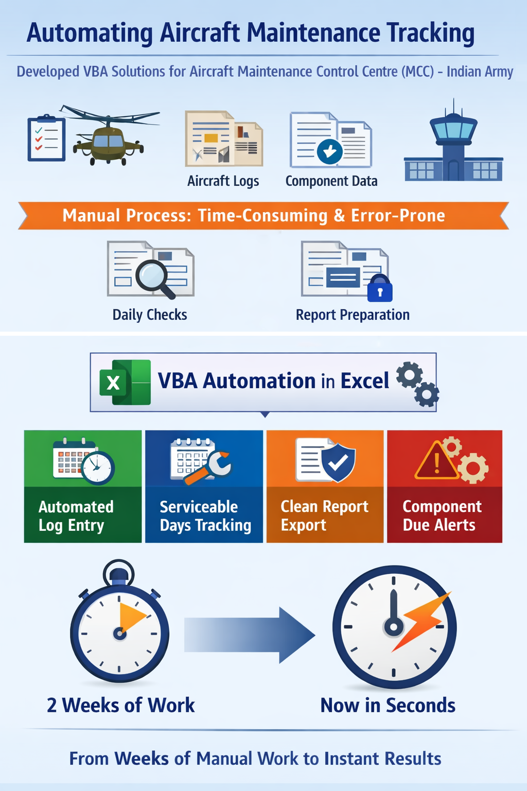
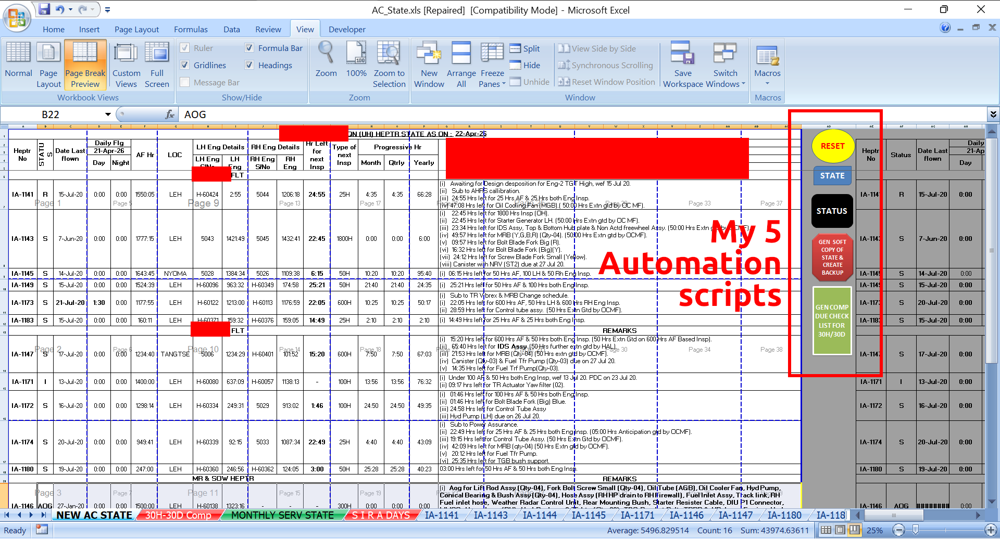
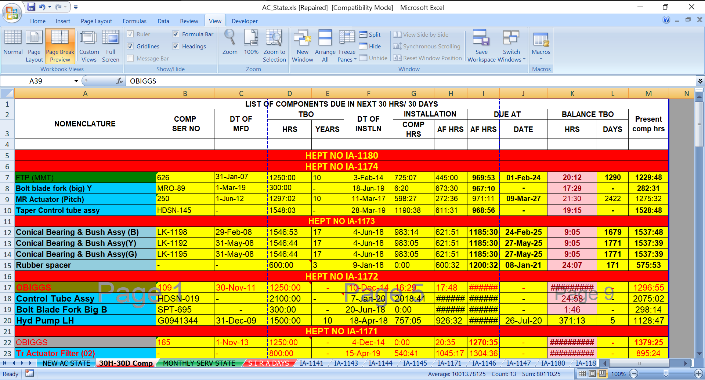
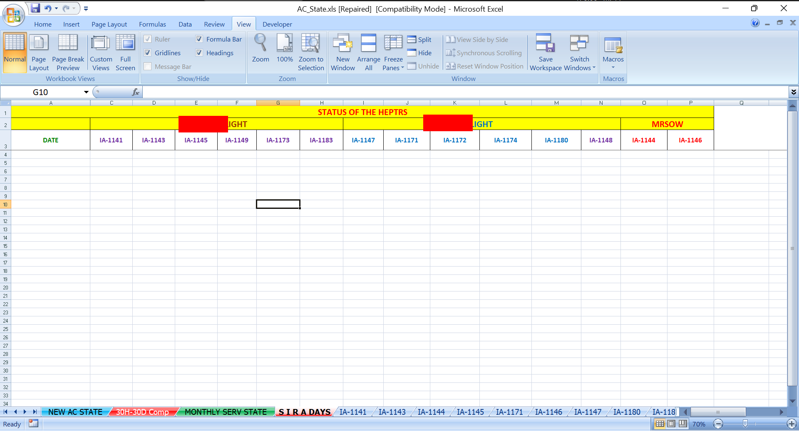
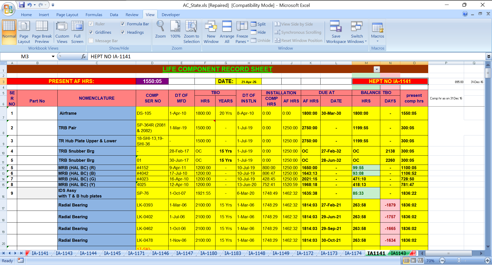

# 🛩️ Army Aviation Maintenance Automation (Excel VBA)

### 🏅 Received a commendation from the Officer Commanding during my **`Leh posting`** for **`developing these automation system`**, which improved operational efficiency during high-pressure conditions following the **`Pulwama attack`**

> [!NOTE]
> Built independently in my free time, outside my primary responsibilities as an Aviation Technician (Avionics – Radio Communication). Driven by curiosity and a passion for problem solving, these automation solutions streamlined Maintenance Control Centre (MCC) operations and became part of the daily workflow.

These automations are now **`actively used across aviation units`**, and I’ve received hundreds of calls — both for support and in recognition of the impact they’ve created.

**Actual system snapshots at bottom**

## 📚 Table of Contents

- [Overview](#-overview)
- [Tech Stack](#️-tech-stack)
- [What This Project Demonstrates](#-what-this-project-demonstrates)
- [Inefficiencies I Noticed](#️-inefficiencies-i-noticed)
- [Problems & Solutions](#️-problems--solutions)
  - [Module 1 — Aircraft State Initialization](#-module-1--aircraft-state-initialization)
  - [Module 2 — Daily Aircraft Log Automation](#-module-2--daily-aircraft-log-automation)
  - [Module 3 — Serviceability Tracking](#-module-3--serviceability-tracking)
  - [Module 4 — Digital Aircraft State Reporting & Archiving](#-module-4--digital-aircraft-state-reporting--archiving)
  - [Module 5 — Critical Component Due Monitoring System](#-module-5--critical-component-due-monitoring-system) 🏅
- [System Snapshots](#-system-snapshots-actual-implementation)
- [Security Notice](#-security-notice)

## 📖 Overview

While serving as an Aviation Technician (Avionics – Radio Communication), I independently built automation solutions for Maintenance Control Centre (MCC) operations in my free time.

I focused on identifying bottlenecks, eliminating repetitive tasks, and creating systems that improved operational efficiency, maintenance awareness, and data accessibility—transforming processes that once required days or weeks into tasks completed in seconds.

## 🛠️ Tech Stack

- Microsoft Excel
- VBA (Visual Basic for Applications)
- Spreadsheet automation
- File system automation

## 🧠 What This Project Demonstrates

- **Initiative and Ownership** — Independently conceived, developed, and implemented automation systems outside primary trade responsibilities, driven by curiosity and a desire to improve processes.

- **Problem Solving Mindset** — Identified operational bottlenecks and designed practical solutions to eliminate manual effort and improve efficiency.

- **Process Automation** — Transformed repetitive maintenance tasks into automated workflows, reducing execution time from weeks to seconds.

- **Systems Thinking** — Built interconnected solutions that improved data flow, reporting, tracking, and operational visibility across multiple aircraft.

- **Operational Efficiency Improvement** — Simplified complex processes, reduced administrative workload, and enabled faster decision-making.

- **Analytical Thinking** — Analyzed existing workflows, identified failure points, and developed reliable mechanisms to prevent errors and missed maintenance actions.

- **Data Management & Reporting** — Automated data collection, validation, historical record keeping, and report generation.

- **Preventive Monitoring** — Created proactive alerting mechanisms to identify approaching component maintenance limits before they became operational risks.

- **Safety and Mission Readiness Focus** — Developed solutions that improved maintenance awareness and supported continuous aircraft availability during high-tempo operations.

- **Continuous Improvement** — Challenged inefficient manual procedures and introduced scalable solutions that delivered long-term operational benefits.

## ⚠️ Inefficiencies I Noticed

Aircraft maintenance tracking required:

- Manually copying data across multiple sheets
- Updating daily aircraft logs
- Calculating serviceable days
- Generating shareable reports internally
- Sharing values only report to base
- Monitoring components nearing maintenance limits
- Hard to find old records

These tasks were performed **manually across multiple aircraft**, which could take **hours or even weeks of effort** and carried a high risk of human error.

## ⚔️ Problems & Solutions

I developed **five VBA automation modules** that transformed the workbook into an automated maintenance management tool.

Each module performs a specific operational function.

---

### 🧩 Module 1 — Aircraft State Initialization

**Problem:**

Daily aircraft state preparation required repetitive manual setup and resetting before operational updates could begin.

**Solution:**

Developed an automation module that:

- Preserved previous aircraft state data as backup references.
- Reset operational hours automatically.
- Prepared worksheets for new daily entries.

**Impact:**

- Eliminated repetitive manual setup.
- Reduced preparation time.
- Improved consistency and data reliability.

---

### 🧩 Module 2 — Daily Aircraft Log Automation

**Problem:**

Aircraft log entries had to be manually made into separate aircraft history sheets, increasing workload and introducing transcription errors.

**Solution:**

Built an automated logging system that:

- Extracted aircraft operational data from the master sheet.
- Inserted entries into individual aircraft log sheets.
- Maintained historical records automatically.

**Impact:**

- Reduced manual data entry.
- Improved accuracy.
- Accelerated daily log maintenance.

---

### 🧩 Module 3 — Serviceability Tracking

**Problem:**

Tracking aircraft availability and serviceable days required manual updates and lacked a consolidated view.

**Solution:**

Implemented automated serviceability monitoring that:

- Recorded daily status.
- Updated S.I.R.A sheets automatically.
- Maintained availability history.

**Impact:**

- Improved visibility into fleet readiness.
- Simplified operational planning.
- Reduced manual tracking effort.

---

### 🧩 Module 4 — Digital Aircraft State Reporting & Archiving

**Problem:**

Aircraft state reports had to be transported to the base daily. Only values-only aircraft state data could be shared through the intranet, or have to submit physical copy physically

**Solution:**

Designed an automated reporting workflow that:

- Generated values-only Excel reports.
- Created Year → Month → Date folder structures automatically.
- Removed unnecessary sections.
- Archived reports digitally.

**Impact:**

- Eliminated daily physical trips to the base only for report submission.
- Created a searchable digital archive of historical reports.
- Reduced dependence on printed records.
- Enabled instant retrieval of past operational data.

---

### 🧩 Module 5 — Critical Component Due Monitoring System

**Problem:**

During the Pulwama attack, Technicians manually reviewed hundreds of component log cards across multiple aircraft to identify maintenance limits. Aircrafts were flying continuously and component expirations became difficult to track manually, creating operational and safety risks.

**Solution:**

Developed a centralized monitoring system that:

- Scanned all aircraft records automatically.
- Detected components with:

  - <30 flight hours remaining.
  - <30 days remaining before expiry.

- Consolidated data into a single dashboard for rapid alert.

**Impact:**

> 🏅 Received a **commendation from the Officer Commanding** for developing this automation system, which improved operational efficiency during high-pressure (`Pulwama attack`) conditions.

- Eliminated manual inspection of hundreds of log cards.
- Reduced a process requiring nearly two weeks of effort to a few seconds.
- Saved approximately 10+ hours of daily work during high-tempo operations.
- Improved maintenance awareness and mission readiness.
- Enhanced safety by proactively identifying and alerting for expiring components.

## 📈 Operational Outcomes

- Eliminated manual aircraft component life tracking by building an automated monitoring system, reducing a two-week inspection process to seconds and saving 10+ hours per day during high-tempo operations.
- Replaced paper-based historical reporting with a digital archival system, enabling instant retrieval of aircraft state records.
- Automated aircraft logbook updates and serviceability tracking, reducing manual effort and improving data accuracy.
- Streamlined daily aircraft state preparation and reporting workflows, eliminating repetitive administrative tasks and daily physical trips for report submission.

## 📸 System Snapshots (Actual Implementation)

Below are real screenshots from the automation system used during operations.

These demonstrate the scale, structure, and functionality of the solution.

`Data is from 2021 and screenshot taken on my system on 2026`

### 🎛️ Automation Control Panel

Centralized control interface for executing automation modules.

- Main AC state
- AC reset for daily initialization
- One-click execution of workflows
- Backup generation (exact values only copy) date wise
- Component due checks (30h / 30d)

### ⏱️ Component Due Monitoring

Displays components approaching maintenance limits (hours/days).

- Highlights critical components automatically
- Consolidates data from multiple aircraft
- Eliminates manual inspection across sheets

### 📊 Aircraft Status Tracking

Provides a quick overview of aircraft availability and operational status.

- Tracks multiple aircraft in a single view
- Simplifies daily monitoring

### 📄 Individual AC Lifecycle Record

Detailed tracking of individual components.

- Tracks installation, usage, and remaining life
- Supports accurate maintenance planning

## 🔒 Security Notice

The original workbook contains **sensitive operational data**, therefore the file is locked and not publicly shared.

A **live demonstration can be presented upon request on my system.**
